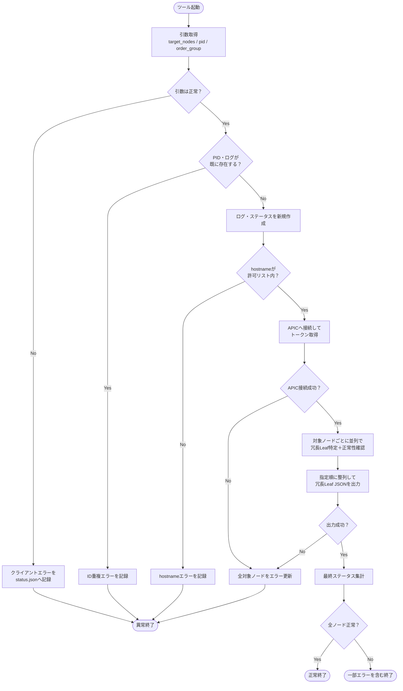
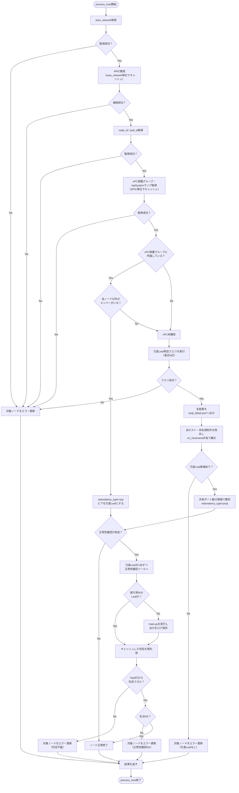

# redundant_leaf.py 仕様書

## 1. 概要

Cisco ACI 環境において、指定された Leaf に対する「冗長 Leaf」を特定し、JSON ファイルとして出力するスクリプト。

各ノードに対し、以下を実施する：

- APIC の vPC 明示的保護グループ（`fabricExplicitGEp` / `fabricNodePEp`）を参照した vPC ピア判定
- vPC 未構成 Leaf に対する、PostgreSQL（`t_if`）の収容機器名（`rm_hostname`）突き合わせによる冗長 Leaf 特定
- 冗長 Leaf 情報の JSON 出力
- ステータス JSON / 各種ログファイルの生成

ファブリックに対しては**参照のみ**で、書き込み（POST / reload / SSH）は一切行わない。APIC への POST は認証（`aaaLogin`）のみ。PostgreSQL も `SELECT` のみで `commit` しない。

## 2. 実行方法

### コマンドライン引数

| 引数 | 必須 | 説明 | 値 |
|---|---|---|---|
| `--target_nodes` | ◯ | 対象ホスト名（カンマ・空白区切り） | 例: `tdqntys1-Leaf01,tdqntys1-Leaf02` |
| `--pid` | ◯ | 処理 ID（ステータス／ログのキー） | 任意の文字列 |
| `--order_group` | ◯ | オーダーグループ ID（UID） | 任意の文字列 |

`nodeshut_vup.py` の `--scenario_id` / `--type` は持たない（Leaf 専用・シナリオ分岐なしのため）。

### 制約

- Leaf hostname は `Leaf` または `leaf` を含む必要あり（Spine は対象外）
- 同一ホストを複数指定した場合は 1 回だけ処理する（引数パース時に重複排除）
- ノード数の上限なし（`MAX_WORKERS` の範囲で並列処理）

### 実行例

```
python3 redundant_leaf.py \
    --target_nodes tdqntys1-Leaf01,tdqntys1-Leaf05 \
    --pid P001 \
    --order_group OG001
```

## 3. ディレクトリ構成

```
<script_directory>/
├── redundant_leaf.py
├── config.py
├── result_code.py
└── log/<uid>/
    ├── <pid>_status.json                    # 全体ステータス
    ├── <pid>_processing.log                 # 処理進捗ログ
    ├── <pid>_detail.log                     # 詳細ログ
    ├── <pid>_redundant_leaf.json            # 冗長Leaf情報（成果物）
    ├── <pid>_<hostname>_psql_detail.json    # PSQL判定時のクエリ生結果（該当ノードのみ）
    └── <pid>_<leaf>_normalcy.log            # 冗長Leafの正常性確認出力（冗長Leaf 1台につき1本）
```

正常性確認ツール（既定 `/home/kddi/scripts/normalcy_check/main.py`）は本ツールと同一サーバ上に存在する前提。パスは `config.NORMALCY_CHECK_PATH` で変更できる。

`nodeshut_vup.py` にある `<pid>.log`（STEP 単位のメインログ）は持たない。`run/<uid>/` 配下も生成しない（APIC へ投入する JSON が無いため）。

## 4. ステータスコード

`result_code` モジュールで定義：

| コード種別 | 意味 |
|---|---|
| `STATUS_CODE_SUCCESS` | 全体正常終了 |
| `STATUS_CODE_SERVER_ERROR` | サーバーエラー |
| `STATUS_CODE_CLIENT_ERROR` | 入力エラー |
| `DUPLICATE_ID_CLIENT_ERROR` | UID／PID 重複 |
| `HOSTNAME_NOT_ALLOWED_CLIENT_ERROR` | hostname がDBに不在 |
| `EACH_STATUS_CODE_IN_PROGRESS` | ノード処理中 |
| `EACH_STATUS_CODE_COMPLETED` | ノード正常終了 |
| `EACH_STATUS_CODE_SERVER_ERROR` | ノード異常終了 |

`<pid>_status.json` の `each_status_code`：
- 先頭 `N` → 正常系
- 先頭 `E` → 異常系

最終的に `finalize_status()` が以下を設定：
- 全ノード成功 → `完了`
- 一部または全部失敗 → `異常終了を含む`
- 判定不能 → `不明`

## 5. 処理フロー

```
入口処理
  ├─ 引数取得・バリデーション（target_nodes / pid / order_group）
  ├─ 重複ホスト排除
  ├─ PID 重複チェック（status.json / 各ログ / 成果物 JSON の存在確認）
  ├─ status.json 初期化（全ノード IN_PROGRESS）
  └─ hostname 許可リスト確認（t_ch に存在するか）

事前確認
  └─ APIC 接続確認（token 取得）

冗長Leaf特定（ノードごとに ThreadPoolExecutor で並列実行）
  └─ process_host()
       ├─ area_network 取得（t_ch）
       ├─ APIC 接続（area_network 単位でキャッシュ）
       ├─ node_id / pod_id 取得（topSystem）
       ├─ vPC 保護グループ・topSystem マップ取得（APIC 単位でキャッシュ）
       ├─ find_vpc_peers()
       │   ├─ 保護グループに所属し、自ノード以外のメンバーあり
       │   │   → redundancy_type="vpc"、そのメンバーを冗長Leafとして返す
       │   └─ 保護グループ未所属、またはメンバーが自ノードのみ
       │       → vPC未構成として PSQL 判定へ
       ├─ fetch_redundant_rows()（PSQL 判定時のみ）
       │   ├─ 冗長Leaf特定クエリを実行
       │   └─ 生結果を <pid>_<hostname>_psql_detail.json に出力
       ├─ summarize_redundant_rows()
       │   ├─ 自ホストの行を除外
       │   ├─ Leaf 命名規則に一致しないホスト（SpSw 等）を除外
       │   ├─ 冗長Leaf候補ごとに rm_hostname・ポートを集計
       │   └─ 共有ポート数の降順で整列
       └─ finish_host_result()（vPC 判定・PSQL 判定の共通後処理）
            └─ check_redundant_leafs()
                 ├─ 冗長Leaf を 1 台ずつ正常性確認ツールにかける
                 │   └─ get_normalcy_result()（同一 Leaf は 1 回だけ実行、以降はキャッシュ）
                 ├─ 出力を <pid>_<leaf>_normalcy.log に保存
                 ├─ "Total : OK/NG" 行で判定
                 └─ 全台 OK → EACH_STATUS_CODE_COMPLETED
                     NG／判定不能あり → EACH_STATUS_CODE_SERVER_ERROR

JSON 出力
  └─ <pid>_redundant_leaf.json（--target_nodes の指定順に整列）

finalize_status()
```

## 6. 主要関数

### 6.1 APIC 操作

| 関数 | 役割 |
|---|---|
| `get_token(apic_ip, ...)` | APIC ログインしてトークン取得 |
| `get_token_from_random_node(hostname)` | hostname から area_network を引き、生きている APIC を選んでトークン取得 |
| `apic_select(hostname)` | DB から area_network・APIC 候補を取得 |
| `get_area_network(hostname)` | DB から hostname の area_network のみを取得（取得不可なら None） |
| `check_connection(apic_ips)` | 候補 IP の中から到達可能なものをランダム選択（未認証 GET が 403 を返すことで判定） |
| `get_hostname_info(hostname, ...)` | ノードの node_id / pod_id を取得（topSystem） |
| `get_topsystem_map(token, apic_ip)` | node_id → hostname / pod_id / role のマップを取得 |
| `get_vpc_groups(token, apic_ip)` | vPC 明示的保護グループとメンバー node_id 一覧を取得 |
| `find_vpc_peers(node_id, vpc_groups, node_map)` | 対象ノードの vPC ピアを返す（未構成なら空リスト） |

### 6.2 PostgreSQL 操作

| 関数 | 役割 |
|---|---|
| `fetch_from_psql(...)` | 1 列目のみを文字列リストで返す（既存ツールと同じ挙動、失敗時は空リスト） |
| `fetch_dict_rows_from_psql(...)` | 全列を dict のリストで返す（冗長Leaf特定クエリ用、失敗時は例外） |
| `apply_session_params(cur)` | `work_mem` / `statement_timeout` を `SET LOCAL` で適用（書式検証あり） |
| `hostname_exists(hostname)` | t_ch に hostname が存在するか（許可リスト確認） |
| `fetch_redundant_rows(hostname)` | 冗長Leaf特定クエリを実行し全行を返す |

### 6.3 判定・集計

| 関数 | 役割 |
|---|---|
| `is_leaf_hostname(hostname)` | 命名規則（`Leaf` / `leaf` を含む）による Leaf 判定 |
| `summarize_redundant_rows(hostname, rows)` | クエリ結果を冗長Leaf候補ごとに集計し、共有ポート数の降順で返す |
| `jsonable(value)` | datetime 等を JSON 出力可能な型へ変換 |
| `write_psql_detail(...)` | クエリの生結果をホスト単位の JSON に保存 |
| `process_host(...)` | 1 ホスト分の冗長Leaf特定を行い結果 dict を返す（スレッドから呼ばれる） |

### 6.4 正常性確認ツール連携

| 関数 | 役割 |
|---|---|
| `run_normalcy_check(...)` | 冗長Leaf 1 台に対し `python3 <NORMALCY_CHECK_PATH> <leaf>` を実行し、出力をログ保存 |
| `parse_normalcy_total(output)` | 出力から `Total : OK/NG` 行を抽出（見つからなければ `None` = 判定不能） |
| `get_normalcy_result(...)` | 結果をキャッシュ付きで返す。同一 Leaf は 1 回だけ実行する |
| `check_redundant_leafs(...)` | 冗長Leaf を 1 台ずつ確認し、結果を各要素に書き戻す |
| `finish_host_result(...)` | 確認結果に応じて `status.json` を更新（vPC / PSQL 両判定からの共通後処理） |

### 6.5 ログ

| 関数 | 役割 |
|---|---|
| `log_processing(dir, pid, msg)` | 処理進捗を記録（標準出力にも） |
| `log_detail(dir, pid, msg)` | デバッグ詳細を記録 |
| `update_node_status(dir, uid, target, code, msg)` | `<pid>_status.json` のノード単位ステータスを更新 |
| `finalize_status(dir, uid)` | `<pid>_status.json` の全体ステータスを確定 |
| `set_client_error_status(dir, uid, hostnames, msg, code)` | 入力エラー時のステータス JSON を一括生成 |
| `fail_all_and_exit(dir, uid, hostnames, msg, code)` | 全ノードを異常終了にして sys.exit(1)（作業開始前の前提条件エラーのみで使用） |

## 7. 判定ロジックの仕様

### 7.1 vPC 判定（優先）

ACI では vPC ペアは「vPC 明示的保護グループ」で定義される。これを唯一の根拠とする。

```
/api/node/class/fabricExplicitGEp.json?rsp-subtree=children&rsp-subtree-class=fabricNodePEp
```

| 状態 | 判定 |
|---|---|
| 保護グループに所属し、他メンバーあり | 該当メンバーを冗長Leafとする（`redundancy_type="vpc"`） |
| 保護グループに所属するがメンバーが自ノードのみ | vPC 未構成として PSQL 判定へ |
| どの保護グループにも所属しない | vPC 未構成として PSQL 判定へ |

配下接続の有無に依存しないため、新設して未結線のペアでも正しく冗長Leafを返す。

### 7.2 PSQL 判定（vPC 未構成時）

同じ収容機器（`rm_hostname`）を持つ Leaf を冗長Leafとみなす。`t_if.if_descr` はカンマ区切りで、2 番目の要素が接続先ホスト名にあたる。

```
if_descr = system,rm_hostname,rm_if,l2_node,number,comment
```

クエリの構造：

| CTE / 句 | 役割 |
|---|---|
| `recent` | 直近 N 日ぶんに絞る。以降の CTE と最終 SELECT はすべてここを参照する |
| `rm_hosts` | 対象 Leaf に紐づく `rm_hostname` を抽出（`if_usage='epg'`、空／`x`／`SpSw\|Leaf` 一致は除外） |
| `hosts_in_same_rm` | 同じ `rm_hostname` を持つ hostname を抽出 |
| `selected_area_network` | 対象 Leaf の `area_network` |
| `selected_rm_hostname` | 対象 Leaf の `rm_hostname`（**除外条件なし**、7.4 参照） |
| 最終 SELECT | `(hostname, if_id)` ごとの最新行のみ採用し、上記 3 集合で絞る |

集計（`summarize_redundant_rows`）：

- 対象ホスト自身の行は除外
- Leaf 命名規則に一致しないホスト（`SpSw` 等）は除外し、除外分は詳細ログに記録
- 候補ごとに `shared_rm_hostnames`（共有している収容機器）と `if_ids` を集約
- `shared_port_count`（共有ポート数）の降順、同数なら hostname 昇順で整列

### 7.3 冗長Leafが 0 件の場合

以下はいずれも `each_status_code=E`（`冗長Leafが見つかりませんでした`）となる。

| 実態 | 現状の扱い |
|---|---|
| クエリ 0 行（配下接続なし＝未結線・アップリンクのみ） | E |
| 自ホストの行のみ（単独収容で冗長Leafが存在しない） | E |
| 候補が命名規則外のみ（SpSw 等） | E |

前 2 者はファブリックの正常な状態であり、本来はエラーではない。現状は区別していない（12 章参照）。

### 7.4 既知の判定上の注意

`selected_rm_hostname` だけ、他の CTE と異なり `if_descr` の空白・`x`・`SpSw|Leaf` 除外が入っていない。このため対象 Leaf に `if_descr` が空のポート（アップリンク等）が 1 本でもあると `''` がこの集合に含まれ、最終フィルタ `rm_hostname IN (...)` が候補 Leaf の空 `if_descr` ポートも拾う。

結果行数が増え、無関係なポートが `if_ids` に混入する可能性がある。元クエリの仕様をそのまま踏襲しているため未修正。

### 7.5 冗長Leafの正常性確認

冗長Leaf を特定した後、その冗長Leaf が実際に健全かを別ツール（`normalcy_check/main.py`）で確認する。冗長先が異常な状態では冗長として機能しないため、特定結果の裏取りにあたる。

対象と実行方法：

- 確認対象は**冗長Leaf のみ**。対象 Leaf（`--target_nodes`）自身は確認しない
- ツールは複数ホストを引数に取れるが、本ツールは**1 台ずつ個別に実行**する
- 同じ冗長Leaf が複数の対象 Leaf から参照された場合、実行は 1 回のみ（9 章参照）

判定ロジック：

- ツール出力の最終行付近に出る `Total : OK` / `Total : NG` を判定に使う
- 複数の `Total` 行があった場合は最後のものを採用する
- `Total` 行が見つからない場合は**判定不能**として扱う

| 冗長Leafの結果 | 対象ノードの扱い |
|---|---|
| 全台 `OK` | `EACH_STATUS_CODE_COMPLETED`（正常終了） |
| 1 台でも `NG` | `EACH_STATUS_CODE_SERVER_ERROR` |
| 判定不能あり（`Total` 行なし・タイムアウト・実行失敗） | `EACH_STATUS_CODE_SERVER_ERROR`（安全側） |

冗長Leaf が複数ある場合、**全台 OK でなければ NG 扱い**とする。

出力先の使い分け：

- `<pid>_status.json`：要約（例「冗長Leaf正常性確認NG（NG: xxxLeaf69）」）
- `<pid>_processing.log`：ホストごとの開始 / OK / NG / 判定不能（キャッシュ再利用時はその旨も）
- `<pid>_detail.log`：`[NORMALCY]` プレフィックスで対象 → 冗長Leaf の判定とログファイル名
- `<pid>_<leaf>_normalcy.log`：ツールの出力全文。先頭にコマンド・対象・時刻・終了コードのヘッダを付与

ON/OFF：`config.NORMALCY_CHECK_ENABLED` で切り替え。`False` の場合は確認をスキップし、冗長Leaf 特定のみで正常終了とする。

## 8. エラー処理方針

| 状況 | 対応 |
|---|---|
| 入力エラー（引数不備・Leaf 命名規則違反） | `set_client_error_status` で記録 → `sys.exit(1)` |
| PID／ログファイル重複 | `DUPLICATE_ID_CLIENT_ERROR` で記録 → `sys.exit(1)` |
| hostname が許可リスト（t_ch）に不在 | `HOSTNAME_NOT_ALLOWED_CLIENT_ERROR` で記録 → `sys.exit(1)` |
| 作業開始前の APIC 接続失敗（ループ前の事前確認） | `fail_all_and_exit` で全体停止 |
| ノード処理内の失敗（area_network 取得／APIC 接続／node_id 取得／vPC 取得／PSQL 検索） | 該当ノードのみ `each_status_code=E` に更新して次のノードへ |
| ノード処理内の例外 | `try/except Exception` でノード単位の異常終了、他ノードは継続 |
| 冗長Leaf 0 件 | 該当ノードを `each_status_code=E` |
| 冗長Leafの正常性確認 NG | 該当ノードを `each_status_code=E`（冗長Leaf 特定結果は JSON に残す） |
| 正常性確認の判定不能（`Total` 行なし・タイムアウト・実行失敗） | 該当ノードを `each_status_code=E`（安全側） |
| 成果物 JSON の出力失敗 | `fail_all_and_exit` で全体停止 |

**エラー処理の原則**：`nodeshut_vup.py` と同じく、一度ノード処理に入った後は個別ノードの失敗で全体を停止せず、該当ノードのみ異常終了として記録する。全体を停止するのは、ループに入る前の前提条件エラー（最初の APIC 接続）と、最後の成果物出力失敗のみ。

## 9. 並列処理

- ノードごとに `ThreadPoolExecutor` でスレッド起動（並列度は `MAX_WORKERS`、既定 4）
- APIC 接続情報は `area_network` 単位、vPC 保護グループ・topSystem マップは APIC 単位でキャッシュし、`cache_lock` で排他制御
- ステータス更新は `status_json_lock` で排他制御
- ログ書き込みは `log_lock` で直列化（行の混在防止）
- 出力順は完了順ではなく `--target_nodes` の指定順に整列
- スレッド内の例外は `future.result()` で捕捉し、該当ノードのみ異常終了とする

正常性確認の並列度：

```
main
 └─ ThreadPoolExecutor(MAX_WORKERS)     ← 対象Leafごとに並列
      └─ process_host()
           └─ check_redundant_leafs()
                └─ run_normalcy_check()  ← 冗長Leafごとに逐次
```

対象 Leaf 間は並列、1 ノード内の冗長Leaf は逐次。したがって `main.py` は最大 `MAX_WORKERS` 個が同時に走る。同時セッション数を抑えたい場合は `MAX_WORKERS=1` で完全に逐次化できる。

同一冗長Leafの重複実行防止：

- 結果は `normalcy_cache`（`leaf_hostname` → 判定・ログパス）に保持する
- 未実行の Leaf にはホスト単位のロック（`normalcy_host_locks`）を取り、ロック内で再度キャッシュを確認してから実行する（ダブルチェックドロッキング）
- 同じ Leaf を狙った別スレッドは先行スレッドの完了を待って結果を再利用するため、**二重実行もログファイルの競合も発生しない**
- ロックは Leaf 単位のため、異なる Leaf の確認は並列のまま
- 再利用された場合、JSON の `normalcy_cached` が `true` になり、処理ログにもその旨を記録する

## 10. 設定（`config` モジュール想定）

### 必須

| 定数 | 用途 |
|---|---|
| `PSQL_HOST` / `PSQL_DB` / `PSQL_USER` / `PSQL_PASSWORD` | PostgreSQL 接続情報 |
| `USERNAME` / `PASSWORD` | APIC 認証情報 |
| `PROTOCOL` | `http` or `https` |

### 任意（未定義なら既定値で動作）

| 定数 | 既定 | 用途 |
|---|---|---|
| `MAX_WORKERS` | `4` | ホスト単位処理の並列度 |
| `PSQL_LOOKBACK_DAYS` | `7` | 冗長Leaf特定クエリの参照期間（日）。短いほど速い |
| `PSQL_WORK_MEM` | `None` | セッションの `work_mem`。例 `"256MB"`。未設定ならサーバ既定 |
| `PSQL_STATEMENT_TIMEOUT` | `None` | セッションの `statement_timeout`。例 `"300s"` |
| `NORMALCY_CHECK_ENABLED` | `True` | 冗長Leafの正常性確認の ON/OFF |
| `NORMALCY_CHECK_PATH` | `/home/kddi/scripts/normalcy_check/main.py` | 正常性確認ツールのパス |
| `NORMALCY_CHECK_TIMEOUT` | `600` | 正常性確認ツール 1 回あたりのタイムアウト（秒） |

`PSQL_WORK_MEM` / `PSQL_STATEMENT_TIMEOUT` は `^[0-9]+(kB|MB|GB|ms|s|min)?$` で書式検証してから `SET LOCAL` する。不正値は警告を出して無視する。

## 11. 出力仕様

### 11.1 `<pid>_redundant_leaf.json`

```json
{
    "order_group": "OG001",
    "pid": "P001",
    "timestamp": "2026-08-07 10:00:00",
    "results": [
        {
            "target_node": "tdqntys1-Leaf01",
            "area_network": "tdqntys1",
            "node_id": "101",
            "pod_id": "1",
            "redundancy_type": "vpc",
            "vpc_group": {
                "name": "vpc-101-102",
                "id": "101",
                "dn": "uni/fabric/protpol/expgep-vpc-101-102",
                "members": ["101", "102"]
            },
            "redundant_leafs": [
                {
                    "hostname": "tdqntys1-Leaf02",
                    "node_id": "102",
                    "pod_id": "1",
                    "normalcy_result": "OK",
                    "normalcy_log_file": "P001_tdqntys1-Leaf02_normalcy.log",
                    "normalcy_cached": false
                }
            ],
            "normalcy_result": "OK",
            "message": "vPCピアから特定"
        },
        {
            "target_node": "tdqntys1-Leaf05",
            "area_network": "tdqntys1",
            "node_id": "105",
            "pod_id": "1",
            "redundancy_type": "psql",
            "redundant_leafs": [
                {
                    "hostname": "tdqntys1-Leaf06",
                    "node_id": "106",
                    "area_network": "tdqntys1",
                    "shared_rm_hostnames": ["srv001", "srv002"],
                    "shared_port_count": 12,
                    "if_ids": ["eth1/1", "eth1/2"],
                    "normalcy_result": "NG",
                    "normalcy_log_file": "P001_tdqntys1-Leaf06_normalcy.log",
                    "normalcy_cached": false
                }
            ],
            "psql_detail_file": "P001_tdqntys1-Leaf05_psql_detail.json",
            "normalcy_result": "NG",
            "message": "収容機器(rm_hostname)の共有から特定 / 冗長Leaf正常性確認NG"
        }
    ]
}
```

`redundant_leafs[]` の中身は判定方法によって異なる。共通で参照できるのは `hostname` と `node_id` のみ。

| フィールド | vpc | psql |
|---|---|---|
| `hostname` | ◯ | ◯ |
| `node_id` | ◯ | ◯ |
| `pod_id` | ◯ | ✕ |
| `area_network` | ✕ | ◯ |
| `shared_rm_hostnames` | ✕ | ◯ |
| `shared_port_count` | ✕ | ◯ |
| `if_ids` | ✕ | ◯ |
| `normalcy_result` | ◯ | ◯ |
| `normalcy_log_file` | ◯ | ◯ |
| `normalcy_cached` | ◯ | ◯ |

`normalcy_*` は `NORMALCY_CHECK_ENABLED=True` のときのみ付与される。`normalcy_result` は `OK` / `NG` / `UNKNOWN`（判定不能）のいずれか。`results[]` 直下にも全冗長Leafを合算した `normalcy_result` が入る。

### 11.2 `<pid>_<hostname>_psql_detail.json`

PSQL 判定になったノードのみ生成。冗長Leaf特定クエリの生結果を全カラムそのまま配列で保持する。判定根拠の追跡用。

### 11.3 `<pid>_<leaf>_normalcy.log`

正常性確認ツールの出力全文。冗長Leaf 1 台につき 1 本で、同じ Leaf が複数の対象から参照された場合も 1 本のみ。

```
# command : python3 /home/kddi/scripts/normalcy_check/main.py dqnoym3b-Leaf69
# target  : dqnoym3b-Leaf68
# leaf    : dqnoym3b-Leaf69
# time    : 2026-09-09 10:00:00
# rc      : 0
----------------------------------------------------------------------
dqnoym3b-Leaf69
・・・（ツールの出力そのまま）・・・
======================================================================
Total                          : OK
```

`# target` は最初にそのツールを起動した対象 Leaf を示す。キャッシュ再利用時は別の対象からも同じログが参照される。

### 11.4 参照例（jq）

```bash
# 対象Leaf → 冗長Leaf の対応
jq -r '.results[] | "\(.target_node) -> \([.redundant_leafs[].hostname] | join(", "))"' P001_redundant_leaf.json

# 判定方法つきの表
jq -r '["TARGET","TYPE","REDUNDANT"], (.results[] |
  [.target_node, .redundancy_type, ([.redundant_leafs[].hostname] | join(","))]) | @tsv' \
  P001_redundant_leaf.json | column -t

# 冗長Leafが取れなかったもの
jq -r '.results[] | select(.redundant_leafs | length == 0) | "\(.target_node): \(.message)"' \
  P001_redundant_leaf.json

# 冗長Leafの正常性確認結果
jq -r '.results[] | .target_node as $t | .redundant_leafs[] |
  "\($t)\t\(.hostname)\t\(.normalcy_result)\t\(.normalcy_log_file)"' \
  P001_redundant_leaf.json | column -t

# NG／判定不能だった冗長Leafだけ
jq -r '.results[].redundant_leafs[] | select(.normalcy_result != "OK") |
  "\(.hostname): \(.normalcy_result) -> \(.normalcy_log_file)"' P001_redundant_leaf.json
```

## 12. 既知の制約

- 冗長Leaf 0 件のケースを区別していない。「配下接続なし」「単独収容」はファブリックの正常な状態だが、候補が命名規則外だった場合と同じ `E` になる
- `selected_rm_hostname` に除外条件がなく、空 `if_descr` のポートを拾う可能性がある（7.4 参照）
- `PSQL_LOOKBACK_DAYS` の期間内に一度も収集されなかったポートは判定対象外となる。ノード停止中・収集エラー継続中の Leaf では冗長Leafが取得できない
- PSQL 判定は vPC 未構成ノードごとに 1 回クエリを投げる。同一 `area_network` の複数ノードをまとめる最適化は未実施
- `hosts_in_same_rm` は `SPLIT_PART(if_descr, ',', 2)` を条件に使うため通常のインデックスが効かない。式インデックス（`CREATE INDEX ON t_if ((SPLIT_PART(if_descr, ',', 2)))`）の併用を推奨
- Leaf 判定は hostname の命名規則（`Leaf` / `leaf` を含む）に依存しており、APIC の `role` 属性は使っていない
- トークンリフレッシュを持たない。ノード数が多く 1 ノードあたりの所要時間が長い場合、APIC のトークン期限（既定 600 秒）に達する可能性がある
- 正常性確認ツールは `cwd` を指定せずに起動する。ツール側が相対パスで設定ファイル等を読む作りの場合、`cwd` 指定の追加が必要
- 正常性確認の判定は `Total` 行のみに依存する。個別項目（Faults / Module status など）の内訳は解釈せず、ログファイルに残すだけ
- 冗長Leaf が複数ある場合、1 台でも NG なら対象ノードを NG とする。「1 台でも OK なら可」という運用には対応していない
- 正常性確認の結果キャッシュはプロセス内のみ。同じ冗長Leaf を別 PID で実行した場合は再実行される

## 全体フロー



## ノード単位の冗長Leaf特定



主なエラー経路では、処理ログ・詳細ログ・`status.json`を更新し、最後に各ノードの結果から全体ステータスを確定する。