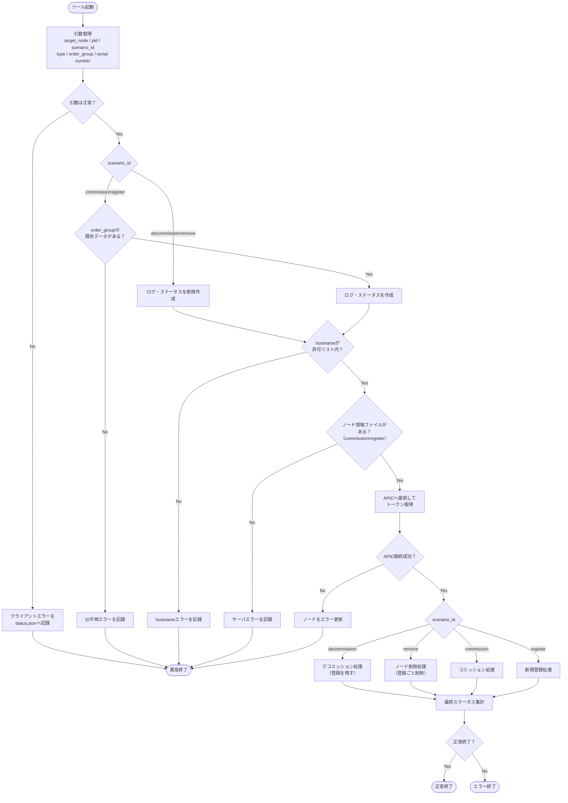
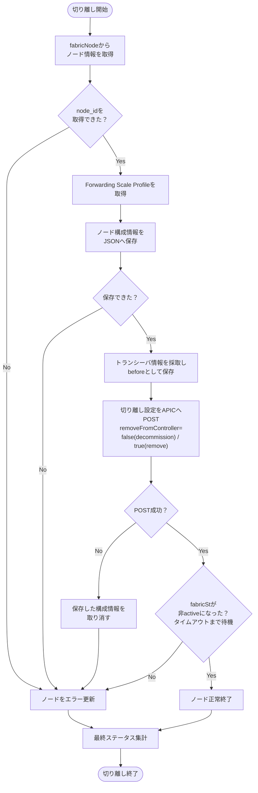
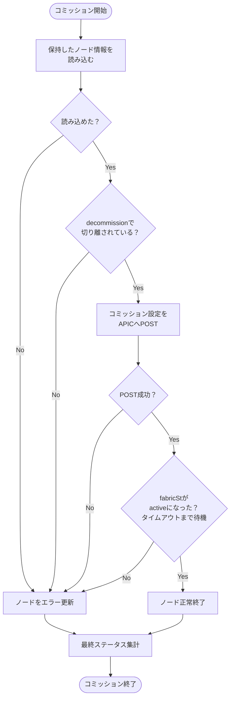
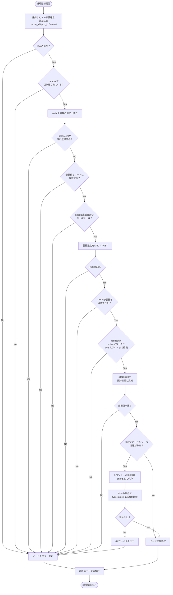

# comm_decomm.py 仕様書

## 1. 概要

Cisco ACI 環境において、APIC API 経由で Leaf / Spine ノードのデコミッション（切り離し）・
コミッション（再組み込み）・新規登録（ノードID登録）を自動化するスクリプト。

シナリオは 4 種類。切り離しは APIC に登録を残す「デコミッション」と、登録ごと削除する
「ノード削除」に分かれ、それぞれ復旧方法（コミッション／新規登録）が対応する。

| 切り離し | removeFromController | 復旧 | 想定作業 |
|---|---|---|---|
| `decommission` | `false` | `commission` | 保守・再起動・ケーブル作業 |
| `remove` | `true` | `register` | 筐体交換（RMA） |

対象ノード 1 台に対し、以下を一括で実施する：

- APIC への投入 payload の組み立てと POST（`fabricRsDecommissionNode` / `fabricNodeIdentP`）
- デコミッション時のノード構成情報・トランシーバ情報の保持（JSON）
- コミッション／新規登録時の保持情報の読み込みと引き継ぎ
- 新規登録の事前確認（二重登録検出、登録待ちノードの実在・ロール検証）
- 投入後の `fabricSt` 状態確認
- 新規登録の事後確認（構成一致確認、トランシーバの事前／事後比較）
- ステータス JSON / 各種ログファイルの生成

`nodeshut_vup.py` の設計・仕様（ステータス JSON によるノード単位の進捗管理、
processing / detail の 2 系統ログ、order_group 単位のファイル受け渡し）を踏襲しつつ、
対象を 1 ノードに絞り、並列処理・SSH ログ採取・vPC 相方チェック・BL-SW トラフィック
確認は持たない。

## 2. 実行方法

### コマンドライン引数

| 引数 | 必須 | 説明 | 値 |
|---|---|---|---|
| `--target_node` | ◯ | 対象ホスト名（1 ノードのみ） | 例: `tdqntys1-Leaf705` |
| `--pid` | ◯ | 処理 ID（ステータス／ログのキー） | 任意の文字列 |
| `--scenario_id` | ◯ | シナリオ種別 | `decommission` / `remove` / `commission` / `register` |
| `--order_group` | ◯ | オーダーグループ ID（UID） | 任意の文字列 |
| `--type` | — | ノード種別（省略時は hostname から推定） | `leaf` or `spine` |
| `--serial-number` | register のみ ◯ | 登録するノードのシリアル番号 | 例: `FDO23211JUY`（`--serial_number` も可） |

### 実行例

保守作業（登録を残して切り離し、そのまま戻す）：

```bash
python3 comm_decomm.py --target_node tdqntys1-Leaf705 \
  --scenario_id decommission --order_group G0001 --pid P0001

python3 comm_decomm.py --target_node tdqntys1-Leaf705 \
  --scenario_id commission --order_group G0001 --pid P0002
```

筐体交換（登録ごと削除し、新しいシリアルで登録し直す）：

```bash
python3 comm_decomm.py --target_node tdqntys1-Leaf705 \
  --scenario_id remove --order_group G0002 --pid P0003

python3 comm_decomm.py --target_node tdqntys1-Leaf705 \
  --scenario_id register --serial-number FDO23211JUY \
  --order_group G0002 --pid P0004
```

### 制約

- `target_node` は 1 ノードのみ（カンマ・空白を含む指定はエラー）
- Leaf hostname は `Leaf` または `leaf` を含む必要あり
- Spine hostname は `SpSw` を含む必要あり
- `scenario_id=register` は `--serial-number` が必須（英数字のみ）
- `commission` / `register` は、切り離し済みの `order_group` を指定する必要あり
- `commission` は `decommission` からの復旧、`register` は `remove` からの復旧であり、
  組み合わせが異なる場合はエラーとなる

## 3. ディレクトリ構成

```
<script_directory>/
├── comm_decomm.py
├── config.py                       # 接続情報・待機秒
├── result_code.py
├── log/<uid>/
│   ├── <pid>_status.json           # 全体・ノードステータス
│   ├── <pid>_processing.log        # 処理進捗ログ（標準出力にも）
│   └── <pid>_detail.log            # 詳細ログ（投入payload・traceback 等）
└── run/<uid>/
    ├── <hostname>_nodeinfo.json            # デコミッション時のノード構成情報
    ├── <hostname>_transceivers_before.json # デコミッション時のトランシーバ情報
    ├── <hostname>_transceivers_after.json  # 新規登録後のトランシーバ情報
    └── <hostname>_transceivers_diff.json   # 差分（不一致時のみ生成）
```

`nodeshut_vup.py` と異なり、投入 payload はファイルを介さずツール内で組み立てて
直接 POST する。投入内容の証跡は `<pid>_detail.log` に記録される。

## 4. ステータスコード

`result_code` モジュールで定義：

| コード種別 | 意味 |
|---|---|
| `STATUS_CODE_SUCCESS` | 全体正常終了 |
| `STATUS_CODE_SERVER_ERROR` | サーバーエラー |
| `STATUS_CODE_CLIENT_ERROR` | 入力エラー |
| `DUPLICATE_ID_CLIENT_ERROR` | UID／PID 重複、order_group 不在 |
| `HOSTNAME_NOT_ALLOWED_CLIENT_ERROR` | hostname が DB に不在 |
| `EACH_STATUS_CODE_IN_PROGRESS` | ノード処理中 |
| `EACH_STATUS_CODE_COMPLETED` | ノード正常終了 |
| `EACH_STATUS_CODE_SERVER_ERROR` | ノード異常終了 |

`<pid>_status.json` の `each_status_code`：
- 先頭 `N` → 正常系
- 先頭 `E` → 異常系

最終的に `finalize_status()` が以下を設定：
- 全ノード成功 → `完了`
- 一部または全部失敗 → `異常終了を含む`
- 判定不能 → `不明`

**トップの `status_code` は個別ノードが異常終了でも成功コードのまま**とする（`異常終了を含む`）。
後続システムへ結果を渡す連携があり、`E` だと次のフローに進めないため。ノード個別の
成否は `results[].each_status_code` で表現する。トップが `E` になるのは、実行以前の
入力エラー（引数不備・PID 重複・order_group 不在・hostname 不許可）のみ。

## 5. シナリオ別フロー

### 5.1 入口処理（全シナリオ共通）

```
[引数検証]
  ├─ target_node / scenario_id / order_group / pid の指定確認
  ├─ target_node が 1 ノードか（カンマ・空白なし）
  ├─ type と hostname の命名規則一致
  └─ register の場合: serial-number の必須・書式確認
      → NG: set_client_error_status → sys.exit(1)（APIC 未接続）

[order_group 確認]（commission / register のみ）
  └─ log/<uid> が存在しない → DUPLICATE_ID_CLIENT_ERROR → sys.exit(1)

[ディレクトリ作成 / PID 重複確認]
  └─ status.json / processing.log / detail.log のいずれか既存 → DUPLICATE_ID_CLIENT_ERROR

[status.json 初期化・ログ空作成]

[hostname 確認]
  └─ t_ch に不在 → HOSTNAME_NOT_ALLOWED_CLIENT_ERROR → sys.exit(1)

[ノード情報ファイル確認]（commission / register のみ）
  └─ run/<uid>/<hostname>_nodeinfo.json が不在
      → fail_and_exit（サーバエラー、`ID不明: <uid>`）
```

### 5.2 デコミッション／ノード削除シナリオ

`decommission` と `remove` はフローが同一で、投入 payload の `removeFromController`
と保存する `decommission_scenario` だけが異なる。

```
[事前確認]
  ├─ APIC 接続（token 取得）
  └─ resolve_node_info()
       ├─ fabricNode から node_id / pod_id / serial / role / model / version
       ├─ 取得不可なら topSystem から node_id / pod_id
       └─ node_id 未取得 → 異常終了

[デコミッション投入]
  ├─ build_decommission_payload()（シナリオに応じた removeFromController）
  ├─ get_fwd_scale_profile() で profType 取得
  ├─ save_node_info() でノード構成情報を保存
  │   └─ 保存失敗 → APIC へ何も投入せず異常終了
  ├─ get_transceivers() → save_transceivers("before")
  │   └─ 取得不可はログのみ（比較が実施されなくなる旨を記録）
  ├─ uni/fabric/outofsvc へ POST（リトライ 3 回）
  │   └─ POST 失敗 → remove_node_info() で保存を取り消し → 異常終了
  └─ sleep(POST_FILE_SLEEP_INTERVAL)

[事後確認]
  └─ wait_for_node_status(desired=False)（DECOMMISSION_CHECK_INTERVAL 間隔）
       └─ タイムアウト → 異常終了

finalize_status()
```

### 5.3 コミッションシナリオ

```
[事前確認]
  ├─ APIC 接続（token 取得）
  └─ load_node_info()（APIC は参照しない）
       ├─ ファイル不在・JSON 破損・node_id 空 → 異常終了
       ├─ decommission_scenario が remove → 異常終了（register を使うべき）
       └─ role / pod_id が空なら引数・既定値で補完

[コミッション投入]
  ├─ build_commission_payload()（status=deleted）
  ├─ uni/fabric/outofsvc へ POST（リトライ 3 回）
  └─ sleep(POST_FILE_SLEEP_INTERVAL)

[事後確認]
  └─ wait_for_node_status(desired=True)（RESTORE_CHECK_INTERVAL 間隔）

finalize_status()
```

### 5.4 新規登録シナリオ

```
[事前確認]
  ├─ APIC 接続（token 取得）
  ├─ load_node_info()（node_id / pod_id / name を引き継ぐ）
  │   └─ decommission_scenario が decommission → 異常終了（commission を使うべき）
  ├─ serial は --serial-number で上書き（筐体交換で変わるため）
  ├─ get_node_ident() による二重登録確認
  │   └─ 同一 serial が登録済み → 異常終了（nodeId / name を提示）
  └─ get_pending_node() による登録待ちノード確認
      ├─ dhcpClient に不在 → 異常終了（未接続・シリアル誤り）
      ├─ nodeId が 0 以外 → 異常終了（既に割当済み）
      └─ nodeRole が type と不一致 → 異常終了

[新規登録投入]
  ├─ build_register_payload()（serial / nodeId / name / podId / role）
  ├─ uni/controller/nodeidentpol へ POST（リトライ 3 回）
  └─ sleep(POST_FILE_SLEEP_INTERVAL)

[事後確認]
  ├─ get_node_ident() で fabricNodeIdentP の登録確認
  ├─ wait_for_node_status(desired=True)（RESTORE_CHECK_INTERVAL 間隔）
  ├─ verify_node_info() で構成 8 項目の一致確認
  │   └─ 不一致あり → 全項目をログ出力後に異常終了
  └─ トランシーバ比較
      ├─ load_transceivers("before")（不在なら比較スキップ）
      ├─ get_transceivers() → save_transceivers("after")
      ├─ compare_transceivers()
      └─ 差分あり → diff ファイル出力 → 異常終了

finalize_status()
```

## 6. 主要関数

### 6.1 APIC 操作

| 関数 | 役割 |
|---|---|
| `get_token(apic_ip, username, password)` | APIC ログインしてトークン取得 |
| `get_token_from_random_node(hostname)` | hostname から area_network を引き、生きている APIC を選んでトークン取得 |
| `apic_select(hostname)` | DB から area_network・APIC 候補を取得 |
| `check_connection(apic_ips)` | 候補 IP の中から到達可能なものをランダム選択 |
| `hostname_exists(hostname)` | t_ch に対象 hostname が存在するか確認 |
| `post_mo(token, apic_ip, mo_dn, payload, ...)` | 任意の MO DN へ payload（dict）を直接 POST（リトライ 3 回・5 秒バックオフ） |

### 6.2 情報取得

| 関数 | 役割 |
|---|---|
| `get_fabric_node_info(token, apic_ip, hostname)` | fabricNode から node_id / pod_id / serial / role / model / version / fabricSt を取得 |
| `get_hostname_info(hostname, ...)` | topSystem から node_id / pod_id を取得（フォールバック用） |
| `resolve_node_info(token, apic_ip, apic, hostname, node_type, serial)` | 投入に必要な値を確定（fabricNode → topSystem、serial は引数優先） |
| `get_node_status(token, apic_ip, hostname)` | fabricSt が active かを判定（MO 不在も False） |
| `get_node_ident(token, apic_ip, serial)` | fabricNodeIdentP の存在確認（二重登録・登録完了の判定） |
| `get_pending_node(token, apic_ip, serial)` | dhcpClient（Nodes Pending Registration）から登録待ちノードを取得 |
| `get_fwd_scale_profile(token, apic_ip, node_id, pod_id)` | topoctrlFwdScaleProf から profType を取得 |
| `get_transceivers(token, apic_ip, node_id, pod_id)` | ethpmFcot から各ポートの typeName / guiSN を取得 |
| `wait_for_node_status(hostname, desired_status, timeout, interval)` | fabricSt が期待値になるのを待つ（毎ループ APIC を選び直す） |

### 6.3 保持ファイル

| 関数 | 役割 |
|---|---|
| `node_info_path(uid, hostname)` | ノード構成情報の保存パスを返す |
| `save_node_info(uid, hostname, info, ...)` | ノード構成情報を JSON で保存（失敗時 None） |
| `load_node_info(uid, hostname, ...)` | 同じ order_group の保持情報を読み込む（読めない場合は例外） |
| `remove_node_info(uid, hostname, ...)` | 投入失敗時に保存済み情報を取り消す |
| `transceiver_path(uid, hostname, phase)` | トランシーバ情報の保存パスを返す（before / after / diff） |
| `save_transceivers(uid, hostname, phase, data, ...)` | トランシーバ情報を JSON で保存 |
| `load_transceivers(uid, hostname, phase, ...)` | 保存済みトランシーバ情報を読み込む（無ければ None） |

### 6.4 payload 生成

| 関数 | 役割 |
|---|---|
| `build_decommission_payload(node_id, pod_id, remove_from_controller)` | `fabricRsDecommissionNode`（created,modified、`decommission` / `remove` 共用） |
| `build_commission_payload(node_id, pod_id)` | `fabricRsDecommissionNode`（deleted） |
| `build_register_payload(hostname, serial, node_id, pod_id, role)` | `fabricNodeIdentP`（created） |
| `build_payload(scenario, info, hostname, remove_from_controller)` | シナリオに応じて上記を振り分け（フラグは `SCENARIO_SPEC` から取得） |

### 6.5 検証

| 関数 | 役割 |
|---|---|
| `verify_node_info(token, apic_ip, hostname, expected, node_type, ...)` | 登録後の構成が保持情報と一致するか確認し、不一致項目のリストを返す |
| `compare_transceivers(before, after)` | トランシーバの事前／事後を比較し、差分の一覧を返す |
| `infer_node_type(hostname)` | `--type` 未指定時に hostname から leaf / spine を推定 |

### 6.6 ログ・ステータス

| 関数 | 役割 |
|---|---|
| `log_processing(dir, pid, msg)` | 処理進捗を記録（標準出力にも） |
| `log_detail(dir, pid, msg)` | デバッグ詳細を記録 |
| `update_node_status(dir, uid, target, code, msg)` | `<pid>_status.json` のノード単位ステータスを更新 |
| `finalize_status(dir, uid)` | `<pid>_status.json` の全体ステータスを確定 |
| `set_client_error_status(dir, uid, hostname, msg, code)` | 入力エラー時のステータス JSON を生成 |
| `fail_and_exit(dir, uid, hostname, msg, code)` | ノードを異常終了にして `sys.exit(1)` |

## 7. 検証ロジックの仕様

### 7.1 ノード情報の保持と引き継ぎ

`decommission` / `remove` の実行時に、対象ノードの構成情報を
`run/<uid>/<hostname>_nodeinfo.json` へ保存する。`commission` / `register` は
同じ `order_group` からこれを読み込む。保存の有無はシナリオで変わらない。

```json
{
    "hostname": "tdqntys1-Leaf705",
    "node_id": "1803",
    "pod_id": "1",
    "serial": "FDO23211JUY",
    "role": "leaf",
    "model": "N9K-C93180YC-EX",
    "version": "n9000-15.2(2e)",
    "fwd_scale_prof": "high-dual-stack",
    "node_type": "leaf",
    "order_group": "G0001",
    "pid": "P0001",
    "remove_from_controller": true,
    "decommission_scenario": "remove",
    "decommissioned_at": "2026-07-31 06:25:21"
}
```

`decommission_scenario` は、どちらのシナリオで切り離したかの記録であり、復旧側の
組み合わせ検証にも使用する。

保存タイミングと失敗時の扱い：

- 保存は **POST の前**に行う。投入後に保存が失敗すると「切り離し済みだが復旧情報が
  無い」状態になるため
- 保存に失敗した場合は APIC へ何も投入せず異常終了する
- POST に失敗した場合は `remove_node_info()` で保存を取り消す（実施していない
  デコミッションの情報を残さない）

読み込み側は APIC へのフォールバックを行わない。`remove` の場合は fabricNode ごと
APIC から消えるため、保持情報が唯一の引き継ぎ手段となる。

### 7.2 切り離し方と復旧方法の整合確認

`commission` / `register` は、保持情報の `decommission_scenario` が対応する切り離し
シナリオと一致するかを確認する。

| 実施した切り離し | 実行可能な復旧 | 誤った組み合わせ |
|---|---|---|
| `decommission` | `commission` | `register` → 異常終了 |
| `remove` | `register` | `commission` → 異常終了 |

APIC 側でも最終的には失敗する組み合わせだが（`remove` 後は fabricNode が無いため
コミッションの投入先が存在せず、`decommission` 後は fabricNodeIdentP が残るため
二重登録として弾かれる）、投入前に理由を明示して止める。

### 7.3 新規登録の事前確認

| 確認 | 参照先 | NG 条件 |
|---|---|---|
| 二重登録 | `fabricNodeIdentP`（serial 引き） | 同一 serial が既に登録済み |
| 登録待ちノードの実在 | `dhcpClient`（id=serial） | エントリが存在しない（未接続・シリアル誤り） |
| ノードID 未割当 | `dhcpClient.nodeId` | `0` 以外（既に割当済み） |
| ロール一致 | `dhcpClient.nodeRole` | `--type` と不一致 |

シリアルは引数で受け取り、API からの自動選択は行わない。`dhcpClient` には
「どの個体をどのホスト名で登録すべきか」を判断する材料が無く（未登録ノードは
`name` が空・`nodeId` が `0`）、登録待ちが複数ある場合に選択できないため。
API は指定値の**検証にのみ**使用する。

### 7.4 構成一致確認（`verify_node_info`）

新規登録の事後、`fabricSt=active` を待った後に実施する。保持情報と、登録後の
`fabricNode` / `topoctrlFwdScaleProf` の実値を突き合わせる。

| 項目 | 比較元 |
|---|---|
| `hostname` | fabricNode.name |
| `node_id` | fabricNode.id |
| `pod_id` | fabricNode.dn（pod-N を抽出） |
| `role` | fabricNode.role |
| `node_type` | fabricNode.role |
| `model` | fabricNode.model |
| `version` | fabricNode.version |
| `fwd_scale_prof` | topoctrlFwdScaleProf.profType |

- `serial` は筐体交換で変わる前提のため比較対象に含めない
- 保持情報に値が無い項目は比較をスキップし、その旨をログに記録
- 不一致があっても途中で打ち切らず、全項目を判定してからまとめて異常終了する
  （原因を一度に把握できるようにするため）

### 7.5 トランシーバ比較（`compare_transceivers`）

デコミッション時に採取した `ethpmFcot` と、新規登録後の実値をポート単位で比較する。
比較対象は `typeName`（種別）と `guiSN`（シリアル番号）。

取得は `state=inserted` で絞り込み、`dn` の `phys-[ethX/Y]` からポート名を抽出する。
`guiSN` は固定長でパディングされるため、格納時に前後の空白を除去する。

```json
{
    "eth1/30": {"typeName": "1000base-T", "guiSN": "MTC24110KA1"}
}
```

判定：

| reason | 条件 |
|---|---|
| 欠落 | 事前にあって事後に無い（挿し忘れ） |
| 増設 | 事後にのみ存在 |
| シリアル相違 | `guiSN` が異なる（挿し間違い・別個体） |
| 種別相違 | `guiSN` は同じだが `typeName` が異なる |

差分がある場合は `<hostname>_transceivers_diff.json` を出力し、各差分を
`<pid>_processing.log` に記録したうえで異常終了する。比較元ファイルが無い場合
（デコミッション時に取得できなかった場合）は比較をスキップする。

### 7.6 出力先の使い分け

| 出力先 | 内容 |
|---|---|
| `<pid>_status.json` | 要約のみ（例「構成不一致: model(期待=..., 実際=...)」） |
| `<pid>_processing.log` | 各処理の開始／OK／NG、比較の項目単位の結果 |
| `<pid>_detail.log` | 投入 URL と payload、取得した属性の生値、traceback、ファイルパス |

## 8. エラー処理方針

| 状況 | 対応 |
|---|---|
| 入力エラー（引数不備、register の serial 未指定） | `set_client_error_status` → `sys.exit(1)`（APIC 未接続） |
| PID 重複 | `set_client_error_status`（`DUPLICATE_ID_CLIENT_ERROR`） → `sys.exit(1)` |
| order_group 不在（`commission` / `register`） | `set_client_error_status`（`DUPLICATE_ID_CLIENT_ERROR`） → `sys.exit(1)` |
| hostname が DB に不在 | `set_client_error_status`（`HOSTNAME_NOT_ALLOWED_CLIENT_ERROR`） → `sys.exit(1)` |
| ノード情報ファイル不在（`commission` / `register`） | `fail_and_exit`（サーバエラー、`ID不明: <uid>`） |
| APIC 接続失敗 | `fail_and_exit`（サーバエラー） |
| ノード情報の取得失敗（node_id 未取得） | 異常終了（投入せず） |
| ノード情報の保存失敗 | 異常終了（投入せず） |
| 切り離し方と復旧方法の不整合 | 異常終了（投入せず） |
| 新規登録の事前確認 NG（二重登録・登録待ち不在・ロール不一致） | 異常終了（投入せず） |
| POST 失敗 | リトライ 3 回後に異常終了（切り離し系は保存情報を取り消し） |
| 状態確認タイムアウト | 異常終了 |
| 構成不一致・トランシーバ不一致 | 異常終了（差分は diff ファイルとログに記録） |

**エラー処理の原則**：対象が 1 ノードのため、`nodeshut_vup.py` のような「該当ノードのみ
E にして次のノードへ進む」分岐は持たない。異常時は常に `status.json` を更新して
`sys.exit(1)` で終了する。ただしトップの `status_code` は成功コードのままとし、
後続システムのフローを止めない（4章参照）。

副作用の順序については、**APIC への投入前に落とせるものは投入前に落とす**方針を取る。
引数検証・保持情報の読み書き・登録待ちノードの検証はいずれも POST より前に実施し、
これらが NG の場合は APIC の状態を変更しない。

## 9. 設定（`config` モジュール想定）

| 定数 | 用途 |
|---|---|
| `PSQL_HOST` / `PSQL_DB` / `PSQL_USER` / `PSQL_PASSWORD` | PostgreSQL 接続情報 |
| `USERNAME` / `PASSWORD` | APIC の認証情報 |
| `PROTOCOL` | `http` or `https` |
| `POST_FILE_SLEEP_INTERVAL` | POST 後の待機秒（未定義なら 5 秒） |
| `NODE_STATUS_TIMEOUT` | 投入後の fabricSt 確認のタイムアウト秒（未定義なら 1800 秒／`0` で状態確認なし） |
| `DECOMMISSION_CHECK_INTERVAL` | 切り離し系の fabricSt 確認間隔（未定義なら 30 秒） |
| `RESTORE_CHECK_INTERVAL` | 復旧系の fabricSt 確認間隔（未定義なら 60 秒） |

いずれも `getattr` で参照するため、`config` 側に未定義でも既定値で動作する。

## 10. 依存モジュール

- `requests` / `urllib3` / `psycopg2`
- ローカル: `config` / `result_code`
- DB: PostgreSQL の `t_ch` テーブル（hostname / area_network / oobmgmt_ip / role）

## 11. 既知の制約

- `wait_for_node_status` の待機条件は `config` の `NODE_STATUS_TIMEOUT` /
  `DECOMMISSION_CHECK_INTERVAL` / `RESTORE_CHECK_INTERVAL` で決まる（既定は 30 分・
  30 秒間隔・60 秒間隔、APIC は毎回選び直し）。実行ごとに変えることはできないため、
  検証時に状態確認を飛ばしたい場合は `NODE_STATUS_TIMEOUT=0` を設定する
- 対象は 1 ノードのみ。複数ノードを扱う場合は呼び出し側で順次実行する
- `commission` / `register` は切り離し時の保持情報が前提のため、本ツール外で
  切り離されたノードには使用できない
- 保持情報に `decommission_scenario` が無い場合（旧版で保存されたファイル）は
  整合確認をスキップする
- 交換機体の `version` は工場出荷版のまま Fabric に参加することがあり、APIC の
  自動アップグレード完了前に構成一致確認を行うと不一致となる可能性がある
- `fwd_scale_prof` の既定は `dual-stack` のため、元が別プロファイルの場合は
  再設定するまで不一致となる
- トランシーバ比較は `fabricSt=active` の直後に実施するため、全ポートの SFP 情報が
  上がりきる前だと「欠落」を誤検出する可能性がある
- 参照系 API（GET）と DB クエリはログに記録されない（POST のみ `detail.log` に記録）

## 全体フロー



## デコミッション／ノード削除（切り離し）

`decommission` と `remove` は同一フロー。投入する `removeFromController` の値と、
保存する `decommission_scenario` だけが異なる。



## コミッション（再組み込み）



## 新規登録



主なエラー経路では、処理ログ・詳細ログ・`status.json` を更新し、最後に結果から
全体ステータスを確定する。
